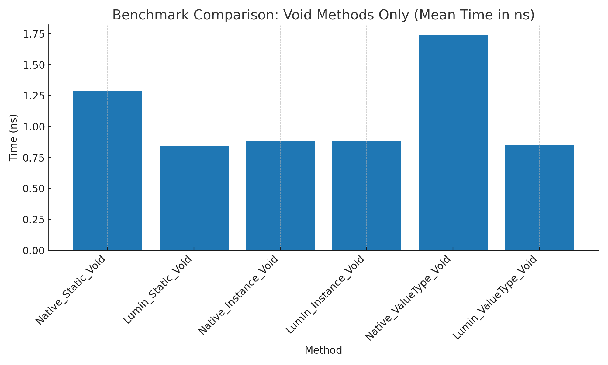
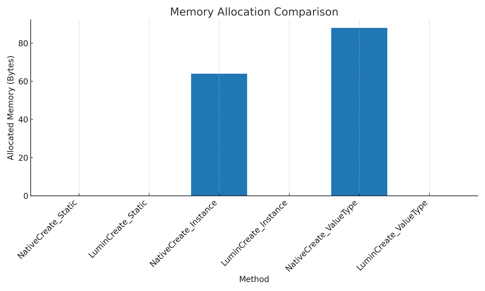

# LuminDelegate

适用于 C# 和 Unity 的零分配、超高性能委托

Zero-Allocation, Ultra-Performance Delegate for C# and Unity



LuminDelegate 是一款基于方法指针的高性能 0GC 委托库，作为 C# 原生委托的全新实现，它在性能与内存控制上实现了突破性优化 —— 对于值类型的委托创建，不同于原生委托会产生装箱操作，LuminDelegate 可完全避免此类开销，且调用速度比原生委托快 50%；对于静态方法，调用效率提升 30%。

LuminDelegate is a high-performance, zero-GC delegate library built on method pointers. As a complete reimagining of C#’s native delegate, it delivers breakthrough optimizations in both speed and memory control: when creating delegates for value types, it completely eliminates the boxing overhead that native delegates incur, while calling them up to 50 % faster; for static methods, invocation efficiency is improved by 30 %.

LuminDelegate具备以下特性：

*   **完全零分配设计**：委托的创建、调用无 GC 分配。
*   **超高性能调用**：基于方法指针的底层实现，值类型委托调用效率超越原生委托 50%，引用类型场景提升 20%。
*   **ref struct 捕获支持**：针对 .NET 9+ 环境优化，可直接捕获 byref（ref struct）类型。
*   **原生委托无缝兼容**：支持与 Action、Func 等原生委托类型双向转换。
*   **全面方法类型支持**：无缝适配静态方法、实例方法、泛型方法（含封闭 / 开放泛型），以及无捕获或捕获 ref struct 的 lambda 与匿名方法，覆盖绝大多数调用场景。
*   **AOT友好**：支持Unity IL2CPP环境

## Quick Start

1.  **定义委托捕获的类**
2.  **调用静态类LuminDelegate的CreateAction或CreateFunction方法**
3.  **指定方法的泛型参数，首位为绑定实例的类型，后续为方法参数类型，对于LuminFunction最后一个泛型为返回值类型。**
4.  **传入实例和方法名，如果条件允许，可以提前缓存方法名的HashCode一并传入以优化性能**
5.  **调用Dispose方法释放资源，否则会导致资源泄漏**

```cpp
class Calculator
{
    public int Add(int a, int b) => a + b;
    public static int Multiply(int a, int b) => a * b;
}
```

```cpp
static int HashCode = string.GetHashCode(nameof(Calculator.Add)); // Optional
static void Main()
{
    Calculator foo = new Calculator();
    using var luminDel = LuminDelegate.CreateFunction<BaseFoo, int, int, int>(foo, nameof(foo.Add), HashCode);
    var value = luminDel.Invoke(5, 10);
    Console.WriteLine($"实例方法结果：{value}  (期望 15)")
}

```

## LuminAction

LuminAction对应原生的Action，应用于无返回值类型。通过LuminDelegate.CreateAction创建。

他有几类泛型参数

*   **TTarget**：委托绑定的实例Type
*   \*\*T1 - T15：\*\*委托绑定的方法参数Type （与Action相同）

```cpp
public class Foo
{
    public int Value;
    
    public void Display() => Console.WriteLine(Value);
}

static void Main()
{
    Foo foo = new Foo { Value = 10 };
    using var luminDel = LuminDelegate.CreateAction<Foo>(foo, nameof(foo.Add)); 
    luminDel.Invoke();
}
```

## LuminFunction

LuminFunction对应原生的Function，应用于有返回值类型。通过LuminDelegate.CreateFunction创建。

他有几类泛型参数

*   **TTarget**：委托绑定的实例类型
*   **T1 - T15**：委托绑定的方法参数类型 （与Action相同）
*   **TResult**：委托绑定的方法返回值类型

```cpp
public class Foo
{
    public int Value;
    
    public int Display() => Value;
}

static void Main()
{
    Foo foo = new Foo { Value = 10 };
    using var luminDel = LuminDelegate.CreateFunction<Foo, int>(foo, nameof(foo.Add)); 
    luminDel.Invoke();
}
```
## IL2CPP
IL2CPP与.Net, Mono环境不同，因此需要显示调用LuminDelegate.SwitchToIl2Cpp()方法以支持IL2CPP。

## 已知bug
Unity Editor环境下捕获泛型方法，当泛型为引用类型时会段报错。
.Net和IL2CPP环境下没有影响。

## Ref Struct

LuminDelegate支持捕获Ref Struct类型。

```cpp
public ref struct Foo
{
    public int Value;
    
    public int Display() => Value;
}

static void Main()
{
    Foo foo = new Foo { Value = 10 };
    using var luminDel = LuminDelegate.CreateFunction<Foo, int>(foo, nameof(foo.Display)); 
    luminDel.Invoke();
}
```

## 与原生委托的转化

#### 原生委托与方法组创建LuminDelegate

```cpp
public class Foo
{
    public int Value;
    
    public int Display() => Value;
}

static void Main()
{
    Foo foo = new Foo { Value = 10 };
    //1.直接传入方法组 （这种方法会产生GC，因为相同于先创建了委托再转成LuminDelegate）
    using var luminDel = LuminDelegate.CreateFunction<Foo, int>(foo.Display); 
    //2.提前创建委托，再传入
    Func<int, int> func = foo.Display;
    using var luminDel2 = LuminDelegate.CreateFunction<Foo, int>(func);
    //3.直接调用原生委托的扩展方法
    using var luminDel3 = func.AsLuminFunction<Foo, int>();
}
```

#### LuminDelegate转原生委托

```cpp
public class Foo
{
    public int Value;
    
    public int Display() => Value;
}

static void Main()
{
    Foo foo = new Foo { Value = 10 };
    
    using var luminDel = LuminDelegate.CreateFunction<Foo, int>(foo, nameof(Foo.Display)); 
    var func = luminDel.ToDelegate<Func<int>>(); //泛型参数为委托的具体类型
}
```

### Lambda

```cpp
static void Main()
{
    //Lambda需把TTarget设为Object
    using var luminDel = LuminDelegate.CreateFunction<object?, int int>( (x) => x ); 
}
```

## 虚方法

```cpp
public class BaseFoo
{
    public virtual int Add(int x) => x;
}

public class Foo : BaseFoo
{
    public int Value;
    
    public override int Add(int x) => Value + x;
    
    public static int StaticAdd(int x) => 100 + x;
}

static void Main()
{
    BaseFoo instance = new Foo { Value = 10 };
    
    using var luminDel = LuminDelegate.CreateFunction<BaseFoo, int, int>(instance , nameof(Foo.Add)); 
}
```

## 静态方法

```cpp
public class Foo
{
    public static int StaticAdd(int x) => 100 + x;
}

static void Main()
{
    //静态方法不需要传递实例
    using var luminDel = LuminDelegate.CreateFunction<Foo, int, int>(nameof(Foo.StaticAdd)); 
}
```


## License 许可证

This library is licensed under the MIT License.

